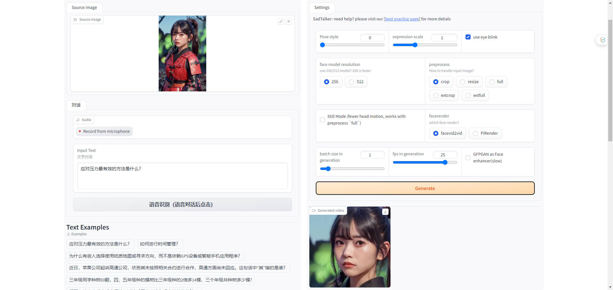

# Digital Avatar Conversational System - Linly-Talker

[English](./README.md) [简体中文](./README_zh.md)

**2023.12 Update** 📆

**Users can upload any images for the conversation**


## Introduction

Linly-Talker is an intelligent AI system that combines large language models (LLMs) with visual models to create a novel human-AI interaction method. It integrates various technologies like Whisper, Linly, Microsoft Speech Services and SadTalker talking head generation system. The system is deployed on Gradio to allow users to converse with an AI assistant by providing images as prompts. Users can have free-form conversations or generate content according to their preferences.


## Setup

```
conda create -n linly python=3.8
conda activate linly

pip install torch==1.11.0+cu113 torchvision==0.12.0+cu113 torchaudio==0.11.0 --extra-index-url https://download.pytorch.org/whl/cu113 

conda install ffmpeg

pip install -r requirements_app.txt
```

## ASR - Whisper

Leverages OpenAI's Whisper, see [https://github.com/openai/whisper](https://github.com/openai/whisper) for usage.

## TTS - Edge TTS

Uses Microsoft Speech Services, see [https://github.com/rany2/edge-tts](https://github.com/rany2/edge-tts) for usage. 

## THG - SadTalker

Talking head generation uses SadTalker from CVPR 2023, see [https://sadtalker.github.io](https://sadtalker.github.io)

Download SadTalker models:

```
bash scripts/download_models.sh
```

## LLM - Linly 

Linly from CVI , Shenzhen University, see https://github.com/CVI-SZU/Linly

Download Linly models: https://huggingface.co/Linly-AI/Chinese-LLaMA-2-7B-hf

```
git lfs install
git clone https://huggingface.co/Linly-AI/Chinese-LLaMA-2-7B-hf
```

Or use the API:

```
# CLI
curl -X POST -H "Content-Type: application/json" -d '{"question": "What are fun places in Beijing?"}' http://url:port

# Python
import requests

url = "http://url:port"  
headers = {
  "Content-Type": "application/json" 
}

data = {
  "question": "What are fun places in Beijing?"
}

response = requests.post(url, headers=headers, json=data)
# response_text = response.content.decode("utf-8")
answer, tag = response.json()
# print(answer)
if tag == 'success':
    response_text =  answer[0]
else:
    print("fail")
print(response_text)
```

## Optimizations

Some optimizations:

- Use fixed input face images, extract features beforehand to avoid reading each time
- Remove unnecessary libraries to reduce total time
- Only save final video output, don't save intermediate results to improve performance 
- Use OpenCV to generate final video instead of mimwrite for faster runtime

## Gradio

Gradio is a Python library that provides an easy way to deploy machine learning models as interactive web apps. 

For Linly-Talker, Gradio serves two main purposes:

1. **Visualization & Demo**: Gradio provides a simple web GUI for the model, allowing users to see the results intuitively by uploading an image and entering text. This is an effective way to showcase the capabilities of the system.

2. **User Interaction**: The Gradio GUI can serve as a frontend to allow end users to interact with Linly-Talker. Users can upload their own images and ask arbitrary questions or have conversations to get real-time responses. This provides a more natural speech interaction method.

Specifically, we create a Gradio Interface in app.py that takes image and text inputs, calls our function to generate the response video, and displays it in the GUI. This enables browser interaction without needing to build complex frontend. 

In summary, Gradio provides visualization and user interaction interfaces for Linly-Talker, serving as effective means for showcasing system capabilities and enabling end users.

## Usage

The folder structure is as follows:

```bash
Linly-Talker/
├── app.py
├── app_img.py 
├── utils.py
├── Linly-api.py
├── Linly-example.ipynb
├── README.md
├── README_zh.md
├── request-Linly-api.py
├── requirements_app.txt
├── scripts
   └── download_models.sh
├── src
   └── .....
├── inputs
   ├── example.png
   └── first_frame_dir
       ├── example_landmarks.txt
       ├── example.mat
       └── example.png
├── examples
   ├── driven_audio
      ├── bus_chinese.wav
      ├── ......
      └── RD_Radio40_000.wav
   ├── ref_video
      ├── WDA_AlexandriaOcasioCortez_000.mp4
      └── WDA_KatieHill_000.mp4
   └── source_image
       ├── art_0.png
       ├── ......
       └── sad.png
├── checkpoints // SadTalker model weights path
   ├── mapping_00109-model.pth.tar
   ├── mapping_00229-model.pth.tar
   ├── SadTalker_V0.0.2_256.safetensors
   └── SadTalker_V0.0.2_512.safetensors
├── gfpgan // GFPGAN model weights path
   └── weights
       ├── alignment_WFLW_4HG.pth
       └── detection_Resnet50_Final.pth
├── Chinese-LLaMA-2-7B-hf // Linly model weights path
    ├── config.json
    ├── generation_config.json
    ├── pytorch_model-00001-of-00002.bin
    ├── pytorch_model-00002-of-00002.bin
    ├── pytorch_model.bin.index.json
    ├── README.md
    ├── special_tokens_map.json
    ├── tokenizer_config.json
    └── tokenizer.model
```

Next, launch the app:

```
python app.py
```


Users can upload images for the conversation

```bash
python app_img.py
```



## Reference

- [https://github.com/openai/whisper](https://github.com/openai/whisper)
- [https://github.com/rany2/edge-tts](https://github.com/rany2/edge-tts)  
- [https://github.com/CVI-SZU/Linly](https://github.com/CVI-SZU/Linly)
- [https://github.com/OpenTalker/SadTalker](https://github.com/OpenTalker/SadTalker)
