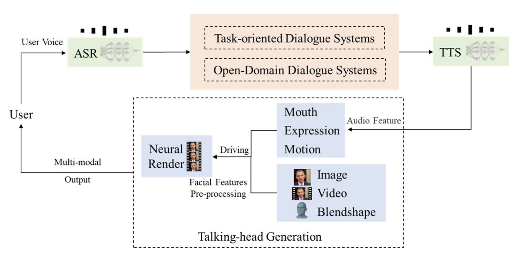
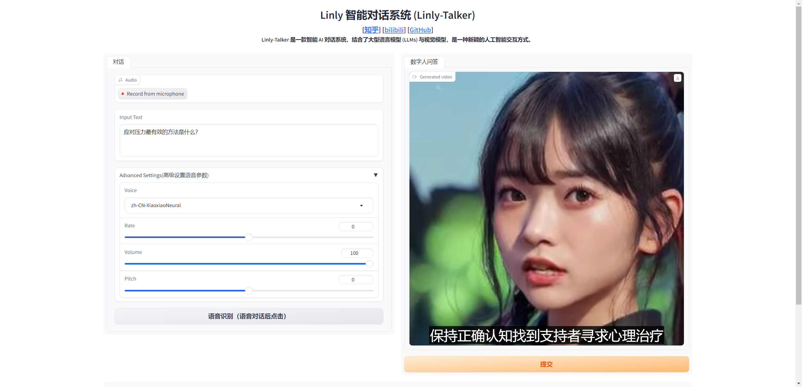

# Digital Avatar Conversational System - Linly-Talker —— "Digital Persona Interaction: Interact with Your Virtual Self"

[English](./README.md) [简体中文](./README_zh.md)

**2023.12 Update** 📆

**Users can upload any images for the conversation**

**2024.01 Update** 📆📆

- **Exciting news! I've now incorporated both the powerful GeminiPro and Qwen large models into our conversational scene. Users can now upload images during the conversation, adding a whole new dimension to the interactions.** 
- **The deployment invocation method for FastAPI has been updated.**
- **The advanced settings options for Microsoft TTS have been updated, increasing the variety of voice types. Additionally, video subtitles have been introduced to enhance visualization.**
- **Updated the GPT multi-turn conversation system to establish contextual connections in dialogue, enhancing the interactivity and realism of the digital persona.**

## Introduction

Linly-Talker is an intelligent AI system that combines large language models (LLMs) with visual models to create a novel human-AI interaction method. It integrates various technologies like Whisper, Linly, Microsoft Speech Services and SadTalker talking head generation system. The system is deployed on Gradio to allow users to converse with an AI assistant by providing images as prompts. Users can have free-form conversations or generate content according to their preferences.




## TO DO LIST

- [x] Completed the basic conversation system flow, capable of `voice interactions`.
- [x] Integrated the LLM large model, including the usage of `Linly`, `Qwen`, and `GeminiPro`.
- [x] Enabled the ability to upload `any digital person's photo` for conversation.
- [x] Integrated `FastAPI` invocation for Linly.
- [x] Utilized Microsoft `TTS` with advanced options, allowing customization of voice and tone parameters to enhance audio diversity.
- [x] `Added subtitles` to video generation for improved visualization.
- [x] GPT `Multi-turn Dialogue System` (Enhance the interactivity and realism of digital entities, bolstering their intelligence)
- [ ] `Voice Cloning` Technology (Synthesize one's own voice using voice cloning to enhance the realism and interactive experience of digital entities)
- [ ] Integrate the `Langchain` framework and establish a local knowledge base.
- [ ] `Real-time` Speech Recognition (Enable conversation and communication between humans and digital entities using voice)

🔆 The Linly-Talker project is ongoing - pull requests are welcome! If you have any suggestions regarding new model approaches, research, techniques, or if you discover any runtime errors, please feel free to edit and submit a pull request. You can also open an issue or contact me directly via email. 📩⭐ If you find this repository useful, please give it a star! 🤩

## Example

|                        文字/语音对话                         |                          数字人回答                          |
| :----------------------------------------------------------: | :----------------------------------------------------------: |
|                 应对压力最有效的方法是什么？                 | <video src="https://github.com/Kedreamix/Linly-Talker/assets/61195303/f1deb189-b682-4175-9dea-7eeb0fb392ca"></video> |
|                      如何进行时间管理？                      | <video src="https://github.com/Kedreamix/Linly-Talker/assets/61195303/968b5c43-4dce-484b-b6c6-0fd4d621ac03"></video> |
|  撰写一篇交响乐音乐会评论，讨论乐团的表演和观众的整体体验。  | <video src="https://github.com/Kedreamix/Linly-Talker/assets/61195303/f052820f-6511-4cf0-a383-daf8402630db"></video> |
| 翻译成中文：Luck is a dividend of sweat. The more you sweat, the luckier you get. | <video src="https://github.com/Kedreamix/Linly-Talker/assets/61195303/118eec13-a9f7-4c38-b4ad-044d36ba9776"></video> |

## Setup

```bash
conda create -n linly python=3.8
conda activate linly

pip install torch==1.11.0+cu113 torchvision==0.12.0+cu113 torchaudio==0.11.0 --extra-index-url https://download.pytorch.org/whl/cu113 

conda install -q ffmpeg

pip install -r requirements_app.txt
```

For the convenience of deployment and usage, an `configs.py` file has been updated. You can modify some hyperparameters in this file for customization:

```bash
# 设备运行端口 (Device running port)
port = 7870
# api运行端口及IP (API running port and IP)
ip = '127.0.0.1' 
api_port = 7871
# Linly模型路径 (Linly model path)
mode = 'api' # api 需要先运行Linly-api-fast.py
mode = 'offline'
model_path = 'Linly-AI/Chinese-LLaMA-2-7B-hf'
# ssl证书 (SSL certificate) 麦克风对话需要此参数
ssl_certfile = "/path/to/Linly-Talker/https_cert/cert.pem"
ssl_keyfile = "/path/to/Linly-Talker/https_cert/key.pem"
```

This file allows you to adjust parameters such as the device running port, API running port, Linly model path, and SSL certificate paths for ease of deployment and configuration.

## ASR - Whisper

Leverages OpenAI's Whisper, see [https://github.com/openai/whisper](https://github.com/openai/whisper) for usage.

## TTS - Edge TTS

Uses Microsoft Speech Services, see [https://github.com/rany2/edge-tts](https://github.com/rany2/edge-tts) for usage. 

I have written a class called `EdgeTTS` that enhances usability and includes the functionality to save subtitle files.

```python
class EdgeTTS:
    def __init__(self, list_voices = False, proxy = None) -> None:
        voices = list_voices_fn(proxy=proxy)
        self.SUPPORTED_VOICE = [item['ShortName'] for item in voices]
        self.SUPPORTED_VOICE.sort(reverse=True)
        if list_voices:
            print(", ".join(self.SUPPORTED_VOICE))

    def preprocess(self, rate, volume, pitch):
        if rate >= 0:
            rate = f'+{rate}%'
        else:
            rate = f'{rate}%'
        if pitch >= 0:
            pitch = f'+{pitch}Hz'
        else:
            pitch = f'{pitch}Hz'
        volume = 100 - volume
        volume = f'-{volume}%'
        return rate, volume, pitch

    def predict(self,TEXT, VOICE, RATE, VOLUME, PITCH, OUTPUT_FILE='result.wav', OUTPUT_SUBS='result.vtt', words_in_cue = 8):
        async def amain() -> None:
            """Main function"""
            rate, volume, pitch = self.preprocess(rate = RATE, volume = VOLUME, pitch = PITCH)
            communicate = Communicate(TEXT, VOICE, rate = rate, volume = volume, pitch = pitch)
            subs: SubMaker = SubMaker()
            sub_file: Union[TextIOWrapper, TextIO] = (
                open(OUTPUT_SUBS, "w", encoding="utf-8")
            )
            async for chunk in communicate.stream():
                if chunk["type"] == "audio":
                    # audio_file.write(chunk["data"])
                    pass
                elif chunk["type"] == "WordBoundary":
                    # print((chunk["offset"], chunk["duration"]), chunk["text"])
                    subs.create_sub((chunk["offset"], chunk["duration"]), chunk["text"])
            sub_file.write(subs.generate_subs(words_in_cue))
            await communicate.save(OUTPUT_FILE)
            
        
        # loop = asyncio.get_event_loop_policy().get_event_loop()
        # try:
        #     loop.run_until_complete(amain())
        # finally:
        #     loop.close()
        asyncio.run(amain())
        with open(OUTPUT_SUBS, 'r', encoding='utf-8') as file:
            vtt_lines = file.readlines()

        # 去掉每一行文字中的空格
        vtt_lines_without_spaces = [line.replace(" ", "") if "-->" not in line else line for line in vtt_lines]
        # print(vtt_lines_without_spaces)
        with open(OUTPUT_SUBS, 'w', encoding='utf-8') as output_file:
            output_file.writelines(vtt_lines_without_spaces)
        return OUTPUT_FILE, OUTPUT_SUBS
```

At the same time, I have created a simple `WebUI` in the `src` folder.

```bash
python TTS_app.py
```


## THG - SadTalker

Talking head generation uses SadTalker from CVPR 2023, see [https://sadtalker.github.io](https://sadtalker.github.io)

Download SadTalker models:

```bash
bash scripts/download_models.sh
```

## LLM - Conversation

### Linly-AI

Linly-AI from CVI , Shenzhen University, see [https://github.com/CVI-SZU/Linly](https://github.com/CVI-SZU/Linly)

Download Linly models: [https://huggingface.co/Linly-AI/Chinese-LLaMA-2-7B-hf](https://huggingface.co/Linly-AI/Chinese-LLaMA-2-7B-hf)

You can use `git` to download:

```bash
git lfs install
git clone https://huggingface.co/Linly-AI/Chinese-LLaMA-2-7B-hf
```

Alternatively, you can use the `huggingface` download tool `huggingface-cli`:

```bash
pip install -U huggingface_hub

# Set up mirror acceleration
# Linux
export HF_ENDPOINT="https://hf-mirror.com"
# Windows PowerShell
$env:HF_ENDPOINT="https://hf-mirror.com"

huggingface-cli download --resume-download Linly-AI/Chinese-LLaMA-2-7B-hf --local-dir Linly-AI/Chinese-LLaMA-2-7B-hf
```

Or use the API:

```bash
# CLI
curl -X POST -H "Content-Type: application/json" -d '{"question": "What are fun places in Beijing?"}' http://url:port

# Python
import requests

url = "http://url:port"  
headers = {
  "Content-Type": "application/json" 
}

data = {
  "question": "What are fun places in Beijing?"
}

response = requests.post(url, headers=headers, json=data)
# response_text = response.content.decode("utf-8")
answer, tag = response.json()
# print(answer)
if tag == 'success':
    response_text =  answer[0]
else:
    print("fail")
print(response_text)
```

API deployment is recommended with **FastAPI**, which has now been updated to a new version for API usage. FastAPI is a high-performance, user-friendly, and modern Python web framework. It leverages the latest Python features and asynchronous programming to provide the capability for rapid development of Web APIs. This framework is not only easy to learn and use but also comes with powerful features such as automatic documentation generation and data validation. Whether you are building a small project or a large application, FastAPI is a robust and effective tool.

To begin with the API deployment, first, install the libraries used:

```bash
pip install fastapi==0.104.1
pip install uvicorn==0.24.0.post1
```

Other usage methods are generally similar, with the main difference lying in the code implementation, which is simpler and more streamlined. Additionally, it handles concurrency more effectively.

Here is the translation:

```python
from fastapi import FastAPI, Request
from transformers import AutoTokenizer, AutoModelForCausalLM, GenerationConfig
import uvicorn
import json
import datetime
import torch
from configs import model_path, api_port

# Set device parameters
DEVICE = "cuda"  # Use CUDA
DEVICE_ID = "0"  # CUDA device ID, empty if not set
CUDA_DEVICE = f"{DEVICE}:{DEVICE_ID}" if DEVICE_ID else DEVICE  # Combine CUDA device information

# Function to clean GPU memory
def torch_gc():
    if torch.cuda.is_available():  # Check if CUDA is available
        with torch.cuda.device(CUDA_DEVICE):  # Specify CUDA device
            torch.cuda.empty_cache()  # Clear CUDA cache
            torch.cuda.ipc_collect()  # Collect CUDA memory fragments

# Create FastAPI application
app = FastAPI()

# Endpoint to handle POST requests
@app.post("/")
async def create_item(request: Request):
    global model, tokenizer  # Declare global variables for model and tokenizer
    json_post_raw = await request.json()  # Get JSON data from POST request
    json_post = json.dumps(json_post_raw)  # Convert JSON data to string
    json_post_list = json.loads(json_post)  # Convert string to Python object
    prompt = json_post_list.get('prompt')  # Get prompt from the request
    history = json_post_list.get('history')  # Get history from the request
    max_length = json_post_list.get('max_length')  # Get max length from the request
    top_p = json_post_list.get('top_p')  # Get top_p parameter from the request
    temperature = json_post_list.get('temperature')  # Get temperature parameter from the request

    # Generate response using the model
    prompt = f"Please answer the following question in less than 25 words ### Instruction:{prompt}  ### Response:"
    inputs = tokenizer(prompt, return_tensors="pt").to("cuda:0")
    generate_ids = model.generate(inputs.input_ids,
                                  max_new_tokens=max_length if max_length else 2048,
                                  do_sample=True,
                                  top_k=20,
                                  top_p=top_p,
                                  temperature=temperature if temperature else 0.84,
                                  repetition_penalty=1.15, eos_token_id=2, bos_token_id=1, pad_token_id=0)
    response = tokenizer.batch_decode(generate_ids, skip_special_tokens=True, clean_up_tokenization_spaces=False)[0]
    response = response.split("### Response:")[-1]
    now = datetime.datetime.now()  # Get current time
    time = now.strftime("%Y-%m-%d %H:%M:%S")  # Format time as string

    # Build response JSON
    answer = {
        "response": response,
        "status": 200,
        "time": time
    }

    # Build log information
    log = "[" + time + "] " + '", prompt:"' + prompt + '", response:"' + repr(response) + '"'
    print(log)  # Print log
    torch_gc()  # Execute GPU memory cleanup
    return answer  # Return response

# Main function entry point
if __name__ == '__main__':
    # Load pretrained tokenizer and model
    model = AutoModelForCausalLM.from_pretrained(model_path, device_map="cuda:0",
                                                    torch_dtype=torch.bfloat16, trust_remote_code=True)
    tokenizer = AutoTokenizer.from_pretrained(model_path, use_fast=False, trust_remote_code=True)
    model.eval()  # Set model to evaluation mode

    # Start FastAPI application
    uvicorn.run(app, host='0.0.0.0', port=api_port, workers=1)  # Start the application on the specified port and host
```

The default deployment is on port 7871, and you can make a POST call using curl, as shown below:

```bash
curl -X POST "http://127.0.0.1:7871" \
     -H 'Content-Type: application/json' \
     -d '{"prompt": "如何应对压力"}'
```

You can also use the requests library in Python, as shown below:

```python
import requests
import json

def get_completion(prompt):
    headers = {'Content-Type': 'application/json'}
    data = {"prompt": prompt}
    response = requests.post(url='http://127.0.0.1:7871', headers=headers, data=json.dumps(data))
    return response.json()['response']

if __name__ == '__main__':
    print(get_completion('你好如何应对压力'))
```

The returned value will be:

```json
{
  "response": "寻求支持和放松，并采取积极的措施解决问题。",
  "status": 200,
  "time": "2024-01-12 01:43:37"
}
```


### Qwen

Qwen from Alibaba Cloud, see [https://github.com/QwenLM/Qwen](https://github.com/QwenLM/Qwen)

Download Qwen models: [https://huggingface.co/Qwen/Qwen-1_8B-Chat](https://huggingface.co/Qwen/Qwen-1_8B-Chat)

You can use `git` to download:

```bash
git lfs install
git clone https://huggingface.co/Qwen/Qwen-1_8B-Chat
```

Alternatively, you can use the `huggingface` download tool `huggingface-cli`:

```bash
pip install -U huggingface_hub

# Set up mirror acceleration
# Linux
export HF_ENDPOINT="https://hf-mirror.com"
# Windows PowerShell
$env:HF_ENDPOINT="https://hf-mirror.com"

huggingface-cli download --resume-download Qwen/Qwen-1_8B-Chat --local-dir Qwen/Qwen-1_8B-Chat
```


### Gemini-Pro

Gemini-Pro from Google, see [https://deepmind.google/technologies/gemini/](https://deepmind.google/technologies/gemini/)

Request API-keys: [https://makersuite.google.com/](https://makersuite.google.com/)


### LLM Model Selection

In the app.py file, tailor your model choice with ease.

```python
# Uncomment and set up the model of your choice:

# llm = Gemini(model_path='gemini-pro', api_key=None, proxy_url=None) # Don't forget to include your Google API key
# llm = Qwen(mode='offline', model_path="Qwen/Qwen-1_8B-Chat")
# Automatic download
# llm = Linly(mode='offline', model_path="Linly-AI/Chinese-LLaMA-2-7B-hf")
# Manual download with a specific path
llm = Linly(mode='offline', model_path="Linly-AI/Chinese-LLaMA-2-7B-hf")
```


## Optimizations

Some optimizations:

- Use fixed input face images, extract features beforehand to avoid reading each time
- Remove unnecessary libraries to reduce total time
- Only save final video output, don't save intermediate results to improve performance 
- Use OpenCV to generate final video instead of mimwrite for faster runtime

## Gradio

Gradio is a Python library that provides an easy way to deploy machine learning models as interactive web apps. 

For Linly-Talker, Gradio serves two main purposes:

1. **Visualization & Demo**: Gradio provides a simple web GUI for the model, allowing users to see the results intuitively by uploading an image and entering text. This is an effective way to showcase the capabilities of the system.

2. **User Interaction**: The Gradio GUI can serve as a frontend to allow end users to interact with Linly-Talker. Users can upload their own images and ask arbitrary questions or have conversations to get real-time responses. This provides a more natural speech interaction method.

Specifically, we create a Gradio Interface in app.py that takes image and text inputs, calls our function to generate the response video, and displays it in the GUI. This enables browser interaction without needing to build complex frontend. 

In summary, Gradio provides visualization and user interaction interfaces for Linly-Talker, serving as effective means for showcasing system capabilities and enabling end users.

## Usage

There are three modes for the current startup, and you can choose a specific setting based on the scenario.

The first mode involves fixed Q&A with a predefined character, eliminating preprocessing time.

```bash
python app.py
```



The second mode allows for conversing with any uploaded image.

```bash
python app_img.py
```


The third mode builds upon the first one by incorporating a large language model for multi-turn GPT conversations.

```bash
python app_multi.py
```


The folder structure is as follows:

[Baidu (百度云盘)](https://pan.baidu.com/s/1eF13O-8wyw4B3MtesctQyg?pwd=linl) (Password: `linl`)

```bash
Linly-Talker/ 
├── app.py
├── app_img.py
├── utils.py
├── Linly-api.py
├── Linly-api-fast.py
├── Linly-example.ipynb
├── README.md
├── README_zh.md
├── request-Linly-api.py
├── requirements_app.txt
├── scripts
│   └── download_models.sh
├──	src
│	└── .....
├── inputs
│   ├── example.png
│   └── first_frame_dir
│       ├── example_landmarks.txt
│       ├── example.mat
│       └── example.png
├── examples
│   └── source_image
│       ├── art_0.png
│       ├── ......
│       └── sad.png
├── checkpoints // SadTalker model weights path
│   ├── mapping_00109-model.pth.tar
│   ├── mapping_00229-model.pth.tar
│   ├── SadTalker_V0.0.2_256.safetensors
│   └── SadTalker_V0.0.2_512.safetensors
├── gfpgan // GFPGAN model weights path
│   └── weights
│       ├── alignment_WFLW_4HG.pth
│       └── detection_Resnet50_Final.pth
├── Linly-AI // Linly model weights path
│   └── Chinese-LLaMA-2-7B-hf 
│       ├── config.json
│       ├── generation_config.json
│       ├── pytorch_model-00001-of-00002.bin
│       ├── pytorch_model-00002-of-00002.bin
│       ├── pytorch_model.bin.index.json
│       ├── README.md
│       ├── special_tokens_map.json
│       ├── tokenizer_config.json
│       └── tokenizer.model
├── Qwen // Qwen model weights path
│   └── Qwen-1_8B-Chat
│       ├── cache_autogptq_cuda_256.cpp
│       ├── cache_autogptq_cuda_kernel_256.cu
│       ├── config.json
│       ├── configuration_qwen.py
│       ├── cpp_kernels.py
│       ├── examples
│       │   └── react_prompt.md
│       ├── generation_config.json
│       ├── LICENSE
│       ├── model-00001-of-00002.safetensors
│       ├── model-00002-of-00002.safetensors
│       ├── modeling_qwen.py
│       ├── model.safetensors.index.json
│       ├── NOTICE
│       ├── qwen_generation_utils.py
│       ├── qwen.tiktoken
│       ├── README.md
│       ├── tokenization_qwen.py
│       └── tokenizer_config.json
```


## Reference

- [https://github.com/openai/whisper](https://github.com/openai/whisper)
- [https://github.com/rany2/edge-tts](https://github.com/rany2/edge-tts)  
- [https://github.com/CVI-SZU/Linly](https://github.com/CVI-SZU/Linly)
- [https://github.com/QwenLM/Qwen](https://github.com/QwenLM/Qwen)
- [https://deepmind.google/technologies/gemini/](https://deepmind.google/technologies/gemini/)
- [https://github.com/OpenTalker/SadTalker](https://github.com/OpenTalker/SadTalker)


## Star History

[](https://star-history.com/#Kedreamix/Linly-Talker&Date)

